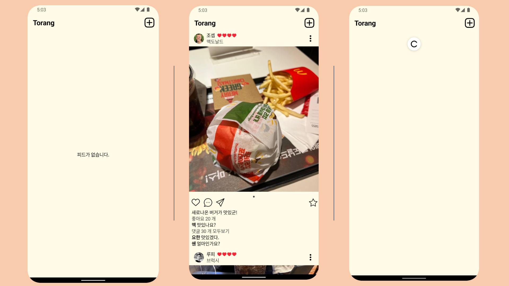
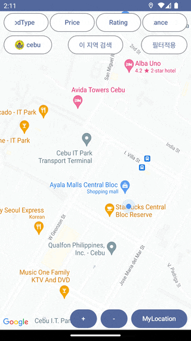
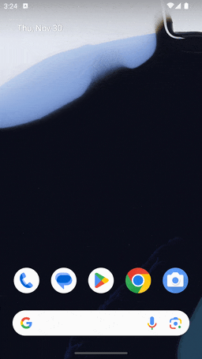
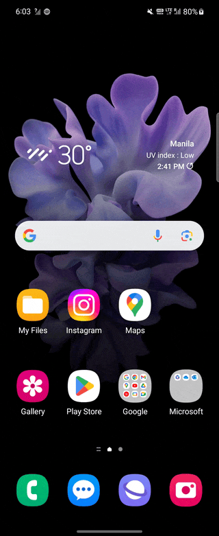
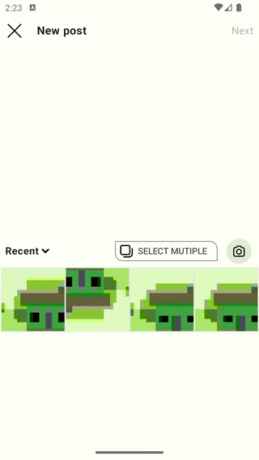

# Torang

## modules

### [feed](https://github.com/sarang628/Feed)

 

- android architecture component
- compose
- modularization

### [finding](https://github.com/sarang628/finding)

 

- android architecture component
- compose
- modularization

### [comment](https://github.com/sarang628/Comment)
 

- android architecture component
- compose
- modularization

### [gallery](https://github.com/sarang628/InstagramGallery)

### [login](https://github.com/sarang628/login)

### [review](https://github.com/sarang628/addReview)
