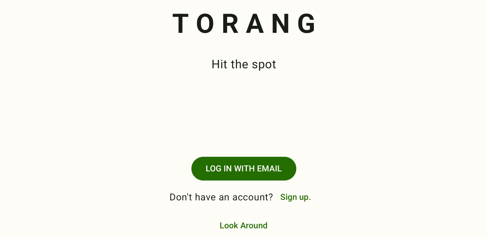

# Torang

무엇을 먹어야 할지 고민일 때? 
내주변 가장 가까운 음식점 
가장 저렴한 혹은 가장 화려한 
상황에 맞는 적절한 음식점 선택 
다양한 사람들과 교류하고 재미있는 컨텐츠들이 가득

# Features
### 피드
### 맛집 찾기
### 음식점 정보
### 리뷰 등록

## Screenshots

# Development Enviroment

# Architecture

# Modularization

## modules

- [feed](https://github.com/sarang628/Feed)
- [finding](https://github.com/sarang628/finding)
- [comment](https://github.com/sarang628/Comment)
- [gallery](https://github.com/sarang628/InstagramGallery)
- [login](https://github.com/sarang628/login)
- [review](https://github.com/sarang628/addReview)

# Build

# Testing

# UI

# Performance