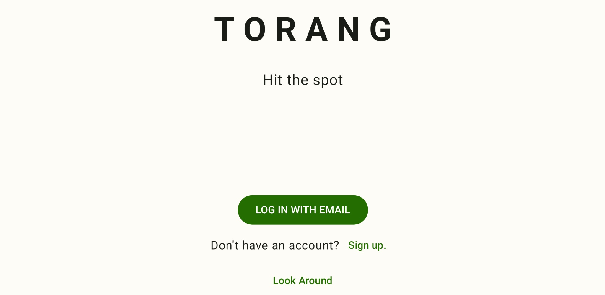
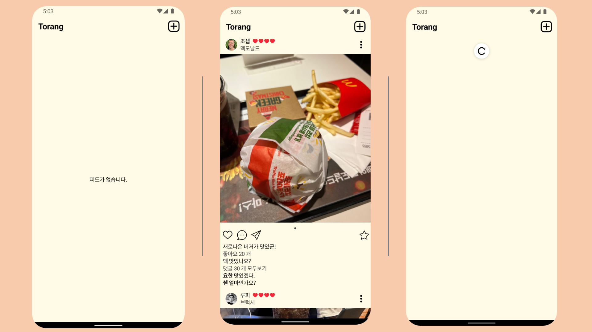

# Torang

음식점 리뷰 및 검색 애플리케이션

## Tech Stack

- [Kotlin](documents/kotlin/Kotlin.md)
- [Android App Architecture](https://developer.android.com/topic/architecture/intro)
- [Multi Module](https://developer.android.com/topic/modularization)
  - 모듈화는 코드베이스를 느슨하게 결합하고 스스로 필요한 것을 모두 갖춘 part(부품)로 나누는 것
- [Hilt](https://developer.android.com/training/dependency-injection/hilt-android)

## Features

### [피드](https://github.com/sarang628/BaseFeed)
- 음식점 리뷰 '리스트 항목(FeedItem)' UI.
- '모듈화' 로 여러 화면에 '일관성' 있게 적용 가능.

### [피드 리스트](https://github.com/sarang628/Feed)
- 피드 리스트 모듈
- 피드 항목 자체에 기능이 많아 리스트와 분리

음식점 리뷰를 리스트

### 맛집 찾기